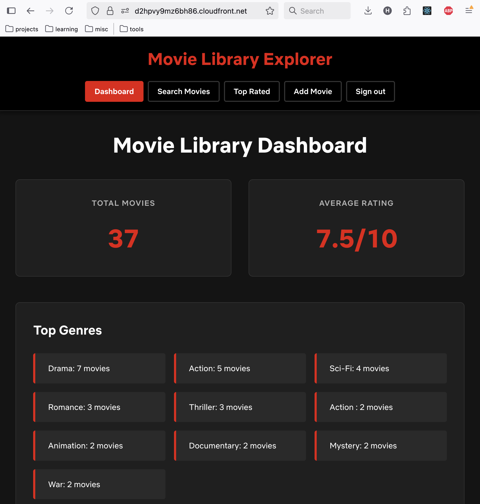
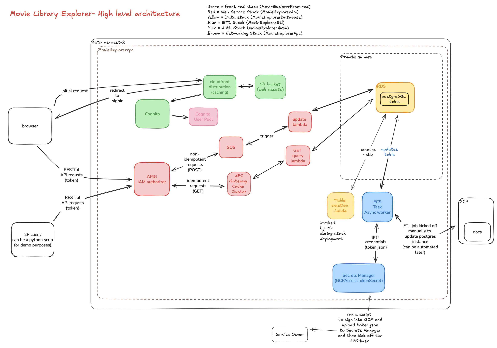

# Movie Library Explorer
Movie Library Explorer is a full stack web application and production-ready API ready for deployment on AWS. An instance has been deployed at at https://d2hpvy9mz6bh86.cloudfront.net/. Anyone can make an account and sign in.

<div align="center">

</div>

## Overview 
This repo contains the entirety of the service, including:
* AWS infrastructure-as-code, defined as CDK stacks in /lib, ready for deployment into a target AWS account
* Front end React.js UI source code, defined in /frontend
* API layer / service logic, which are deployed as a set of serverless (AWS Lambda) functions defined in /lambda
* ETL service, implemented as a AWS ECS task, easily launched via helper_scripts/run_etl_task.sh
* GCP token creation & upload convenience script (required for the ETL service to interface with GCP APIs), implemented in helper_scripts/update_gcp_token.py

## API Documentation

For comprehensive API documentation including authentication, endpoints, parameters, and example responses, see:

**[Complete API Documentation](documentation/api.md)**

## Architecture
The app features the following:
* Highly scalable serverless backend
* Production ready PostgreSQL database hosted on AWS RDS
* React.js web UI 
* Fully automated ETL Worker hosted on AWS ECS
* Caching at the API layer for extremely fast an efficient dashboard page loads
* Ease of maintainance thanks to AWS CDK infrastructure as code & clouformation toolset
* Highly obvservable thanks to automatic integration with AWS Cloudwatch at the API, service, and ETL component layer.



## Deployment and maintenance
### Deploying the stacks to a target AWS account

AWS CDK (Cloud Development Kit) provides a powerful framework for defining cloud infrastructure using familiar programming languages. CDK automatically handles CloudFormation template generation, dependency management, and resource orchestration, making it easy to deploy production-ready services with consistent, repeatable configurations across environments. Within minutes, any developer could self-host an instance of this service in their account or region. Only a few manual commands are necessary - the service is 99.9% described as infrastructure as code. 

#### Prerequisites
```bash
# Install Node.js 18+ and AWS CDK CLI
npm install -g aws-cdk

# Configure AWS credentials (ensure your account has appropriate permissions)
aws configure

# Verify CDK installation
cdk --version
```

#### Deploy the Complete Application
```bash
# Clone the repository and install dependencies
git clone https://github.com/jasondotparse/movie-library-explorer.git
cd movie-library-explorer
npm install

# Build the React frontend
cd frontend && npm install && npm run build && cd ..

# Deploy all stacks (CDK handles dependencies automatically)
cdk deploy --all
```

CDK will automatically deploy the stacks in the correct dependency order and output important URLs and resource identifiers. Note these values for the manual configuration steps described below.

### Database Initialization
The database schema is automatically created by an AWS Custom Resource Lambda function that runs during CDK deployment (of the MovieExplorerDatabase Stack). This ensures the table and indexes are always properly initialized when the infrastructure is deployed.

### Running an ETL job
The folder which hosts the source files for the postgres DB are in a google drive folder, which you will need to have shared with you. Once you create your `credentials` file in GCP and upload it to movie-library-explorer/helper_scripts, you can run helper_scripts/run_etl_task.sh to automatically:
1. upload your credentials to securely-stored AWS Secrets Manager to make it available to ECS
2. kick off a async task worker 

This can be done at your convenience, or whenever the google docs folder has been updated with more folders/files. 

## Tradoffs considered during system design
* If a job is, for some reason, terminated while the async worker has not yet finished its task, the PostgresDB will be half-updated. We consider this acceptable for the time being, and if we got feedback that this constraint is an issue, we could create a task progress queue to ensure that we know where to start up again if the task is brought back online and it sees the previous job was not completed (because there are items in the queue).
* Since I don't have control of the Netflix_Movie_Collection Google Drive folder, and it has only been shared with holtkam2@gmail.com, I have no way to make a service email account so that my ECS task can be granted direct access to GCP and retrieve a token.json. Therefore, we'll have to settle for a script I can run locally on my mac which lets me sign in, then gets a fresh token and pushes it to AWS Secrets Manager for my ECS task to make requets to the Google Drive API.
* due to the fact that API Gateway pushes update requests to an SQS queue, our lambda cannot directly communicate with the front end in the event of an error to add a movie. Every request that is sent to API Gateway is receives a 200 OK in responses, even if the subsequent lambda invocation fails to update the table. This is acceptable for V1 of the app. If this was a common painpoint, however, it would only take a couple hours to fix. We could implement a websocket API gateway endpoint - It would pass the request to SQS and Lambda, including the websocket URL. Then, once the lambda has updated the db (or failed to do so) it could send its status to the websocket URL, which APIG would deliver to the front end. But, for the scope of v1 of this project, that sounds like over-engineering.
* new moves are added using an SQS Queue, and are processed by a lambda on a FIFO basis. This is useful for handling massive traffic loads, but means that users updates are not made to the table instantly. I considered this an acceptable performance tradeoff, since in a scenario where thousands of users are adding movies at the same time, it's important to update them in the DB table in the order in which the requests are received, and besides, we're caching requests to the /dashboard endpoint anyway, so the user would have to wait up to 30 for up-to-date data. This is acceptable for v1 of the app.
* The table does not allow for a movie to have the exact same title/rating/year/genre. But if one of those is differnet from what already exists, that's acceptable. We need to handle edge cases where the same movie title appears many times, even if the rating is the same it may be a different movie if the year is different, and we should support that. 

### Improvements (todo, as time permits)
* The ETL worker could be made more efficient by:
  1. writing to the DB in batch updates 
  2. allowing for jobs to be started / stopped halfway with progress picking up where it left off. This could be done by: 1) traversing the folder breadth-first and putting its subtasks (folders to process) in a SQS queue 2) could recursively push/pull from the queue and process each folder until none are left in the queue. This would allow the job to be stopped/started at will... which could be useful if the folders were massive. It would also allow service operators to monitor progress of the job by observing the size of the SQS queue (this could even be made into an endpoint or websocket API that service owners could connect to in order to monitor ETL progress. All this is unnecessary for V1 of the app.)
* A cloudwatch dashboard could be implemented to inform service owners of key usage data, including alarms and automations for operational effectiveness.
* Automated build pipeline - currently, Cloudformation stack deploymenets must be kicked off by running the cli command from a machine that has AWS credentials configured... instead, the stacks should automatically update when a diff is made to the mainline branch of the repo's /lib directory. 
* test stage: right now, there is only 1 environment the app is deployed in, meaning that any bugs which are pushed may not be discovered until downstream service owners have already experienced them. There should be a test instance of the service where experimental changes are made and tested before being promoted to 'production'. 
* Automated docs: the API documentation should use Swagger (easy to export from API gateway's UI)
* API Client: API Gateway has a feature that allows service owners to generate a client in just a few clicks. If there were really service owners relying upon this service, we should just 'vend the client' instead of just telling them to invoke API Gateway via HTTP. 
* Web UI has a few minor bugs, such as the inability to remove a rating after one has been entered in the 'new movie' field. 

### Manual actions required post cdk stack deployment

**IMPORTANT**: If you need to tear down and completely redeploy from scratch (e.g., for duplicate prevention database schema changes), follow these steps in order:

#### 1. Database Security Group Configuration
After deploying the database stack, you must configure the security groups to allow connections from both Lambda functions and ECS tasks:

```bash
# Get the database security group ID
DB_SG_ID=$(aws ec2 describe-security-groups \
  --filters "Name=group-name,Values=MovieExplorerDatabase-*" \
  --region us-west-1 \
  --query 'SecurityGroups[0].GroupId' \
  --output text)

# Get the Lambda security group ID  
LAMBDA_SG_ID=$(aws ec2 describe-security-groups \
  --filters "Name=group-name,Values=MovieExplorerApi-ApiLambdaSecurityGroup*" \
  --region us-west-1 \
  --query 'SecurityGroups[0].GroupId' \
  --output text)

# Get the ECS task security group ID
ECS_SG_ID=$(aws ec2 describe-security-groups \
  --filters "Name=group-name,Values=MovieExplorerEtl-EtlTaskSecurityGroup*" \
  --region us-west-1 \
  --query 'SecurityGroups[0].GroupId' \
  --output text)

# Allow Lambda functions to connect to database
aws ec2 authorize-security-group-ingress \
  --group-id $DB_SG_ID \
  --protocol tcp \
  --port 5432 \
  --source-group $LAMBDA_SG_ID \
  --region us-west-1

# Allow ECS tasks to connect to database  
aws ec2 authorize-security-group-ingress \
  --group-id $DB_SG_ID \
  --protocol tcp \
  --port 5432 \
  --source-group $ECS_SG_ID \
  --region us-west-1
```

#### 2. Authentication Configuration Updates
When deploying new infrastructure, the CloudFront distribution URL changes. Update the authentication stack:

```bash
# Get the new CloudFront distribution URL from the frontend stack output
CLOUDFRONT_URL=$(aws cloudformation describe-stacks \
  --stack-name MovieExplorerFrontend \
  --region us-west-1 \
  --query 'Stacks[0].Outputs[?OutputKey==`DistributionUrl`].OutputValue' \
  --output text)

echo "New CloudFront URL: $CLOUDFRONT_URL"
```

Update `lib/auth-stack.ts` with the new CloudFront URL in the `callbackUrls` and `logoutUrls` arrays, then redeploy:

```bash
cdk deploy MovieExplorerAuth
```

#### 3. Frontend Configuration Updates
When API Gateway is recreated, update both frontend configuration files:

```bash
# Get the new API endpoint from the API stack output
API_ENDPOINT=$(aws cloudformation describe-stacks \
  --stack-name MovieExplorerApi \
  --region us-west-1 \
  --query 'Stacks[0].Outputs[?OutputKey==`ApiEndpoint`].OutputValue' \
  --output text)

echo "New API Endpoint: $API_ENDPOINT"
```

Update these files with the new API endpoint:
- `frontend/src/config/environment.ts` - Update `apiEndpoint` field
- `frontend/src/config/aws-config.ts` - Update `API.endpoint` field

#### 4. Frontend Rebuild and Redeploy
After updating configuration files, rebuild and redeploy the frontend:

```bash
# Rebuild the frontend with updated configuration
cd frontend && npm run build && cd ..

# Redeploy the frontend stack to upload new build assets
cdk deploy MovieExplorerFrontend
```

#### 5. CORS Configuration (CDK Managed)
CORS is now properly configured in the CDK code (`lib/api-stack.ts`) with:
```typescript
defaultCorsPreflightOptions: {
  allowOrigins: apigateway.Cors.ALL_ORIGINS,
  allowMethods: apigateway.Cors.ALL_METHODS,
  allowHeaders: ['Content-Type', 'X-Amz-Date', 'Authorization', 'X-Api-Key', 'X-Amz-Security-Token'],
}
```

No manual CORS configuration should be needed if deploying via CDK.

#### 6. Optional: CloudFront Cache Invalidation
If frontend changes aren't reflecting immediately, invalidate the CloudFront cache:

```bash
# Get the CloudFront distribution ID
DISTRIBUTION_ID=$(aws cloudformation describe-stacks \
  --stack-name MovieExplorerFrontend \
  --region us-west-1 \
  --query 'Stacks[0].Outputs[?OutputKey==`DistributionId`].OutputValue' \
  --output text)

# Invalidate all cached files
aws cloudfront create-invalidation \
  --distribution-id $DISTRIBUTION_ID \
  --paths "/*" \
  --region us-west-1
```

#### Current Production URLs (as of Session 10)
- **Frontend**: https://d2hpvy9mz6bh86.cloudfront.net
- **API**: https://b97dryed5d.execute-api.us-west-1.amazonaws.com/v1/
- **CloudFront Distribution ID**: E37IS4CV2O6Y6J
- **Cognito Domain**: https://movie-explorer-756021455455.auth.us-west-1.amazoncognito.com


## Postgres table schema

The PostgreSQL database contains a single `movies` table with the following schema:

```sql
CREATE TABLE movies (
    -- Primary key
    id UUID PRIMARY KEY DEFAULT gen_random_uuid(),
    
    -- Core movie attributes
    title VARCHAR(255) NOT NULL,
    genre VARCHAR(100) NOT NULL,
    rating DECIMAL(3,1) CHECK (rating >= 0 AND rating <= 10),
    year INTEGER CHECK (year >= 1900 AND year <= 2100),
    
    -- Metadata
    created_at TIMESTAMP DEFAULT CURRENT_TIMESTAMP,
    updated_at TIMESTAMP DEFAULT CURRENT_TIMESTAMP,
    
    -- Duplicate prevention constraint
    UNIQUE (title, genre, rating, year)
);
```

### Indexes

The following indexes are automatically created for performance:

- `movies_pkey`: Primary key index on `id` (UUID)
- `idx_movies_title`: B-tree index on `title` for fast title searches
- `idx_movies_genre`: B-tree index on `genre` for genre filtering
- `idx_movies_year`: B-tree index on `year` for year-based queries
- `idx_movies_rating`: B-tree index on `rating` for rating-based filtering
- `movies_title_genre_rating_year_key`: Unique constraint index on `(title, genre, rating, year)` for duplicate prevention

### Duplicate Prevention

The database implements duplicate prevention through a unique constraint on the combination of `(title, genre, rating, year)`. This prevents the same movie with identical attributes from being inserted multiple times.

**ETL Behavior**: The ETL worker uses `INSERT ... ON CONFLICT DO NOTHING` to gracefully handle duplicates:
- First ETL run: Inserts new movies normally  
- Subsequent ETL runs: Skips movies that already exist (based on the unique constraint)
- No errors are thrown for duplicates - they are silently ignored

**API Behavior**: When adding movies via the API, duplicate entries will be rejected and return an appropriate error response.

### Schema Details

- **id**: UUID primary key with automatic generation via `gen_random_uuid()`
- **title**: Movie title (required, up to 255 characters)
- **genre**: Movie genre (required, up to 100 characters) 
- **rating**: Movie rating (optional, decimal 0.0-10.0)
- **year**: Release year (optional, 1900-2100 range)
- **created_at**: Automatic timestamp when record is created
- **updated_at**: Automatic timestamp when record is modified
- **Unique constraint**: Combination of (title, genre, rating, year) must be unique across all records
